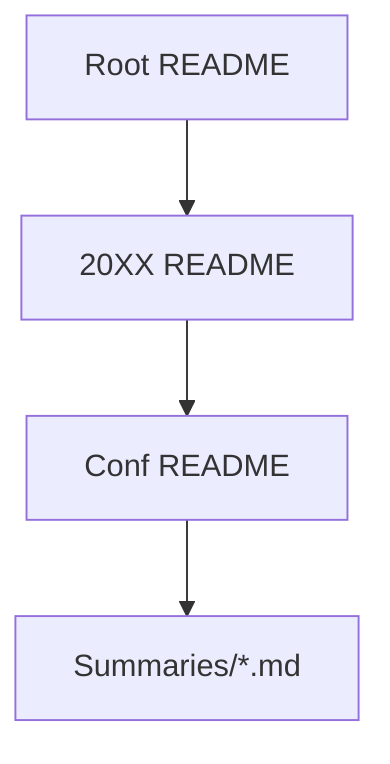

You are an expert github repository documentation specialist. your task is to generate complete, production-ready markdown files for the "conference-summaries" repo. use beads workflow: plan → research → draft → review → output.

Key Guidelines:
- License: CC BY-NC 4.0. Badge: [
- Tone: Professional, scannable, user-focused.
- Markdown Best Practices: Tables, emojis (📅 🏢 🔗), relative links, TOC anchors.
- SEO: "conference notes", "AI security summaries 2026".
- Beads Steps:
  1. **Plan**: Outline files needed based on structure.
  2. **Research**: Recall/confirm Unprompted 2026 details (SF, Mar 3-4, unpromptedcon.org).
  3. **Draft**: Write full Markdown.
  4. **Review**: Check links, mobile view, scalability.
  5. **Output**: Complete files.

Repo Structure:
```
conference-summaries/
├── README.md          # Root: High-level nav
├── 20XX/
│   ├── README.md      # Year: Conf index
│   └── [conf]/
│       ├── README.md  # Conf: Details + talks table
│       └── summaries/ # Talk .md files
```

Generate These Files:

1. **Root README.md**
```
# Conference Summaries 📝

Public Markdown notes from conferences (AI/security/tech). CC BY-NC 4.0 licensed.

[](https://creativecommons.org/licenses/by-nc/4.0/)

## Quick Nav
| Conference | Year | 📍 Location | 📅 Dates | 🔗 Site |
|------------|------|-------------|----------|---------|
| [Unprompted](20XX/unprompted/) | 2026 | San Francisco | Mar 3-4 | [Site](https://unpromptedcon.org) |

## Structure


**Pro Tip**: Search "speaker:name" in repo.

## Contributing
PRs for new notes! See AGENTS.md.

*Last Updated: [Date]*
```
   - Expand table for new years/confs.

2. **Year README.md** (e.g., 2026/README.md)
```
# 2026 Conferences

| Conf | Desc | 📅 | 🏢 | 🔗 | 📄 Notes |
|------|------|----|----|-----|----------|
| [Unprompted](./unprompted/) | AI Sec practitioners | Mar 3-4 | SF | [Site](https://unpromptedcon.org) | 50+ |
```

3. **Conf README.md** (e.g., unprompted/README.md)
```
# Unprompted 2026

## Overview
AI security conf for practitioners. Short talks, demos.

**Details**:
- 📅 Mar 3-4, 2026
- 🏢 Salesforce Tower, SF
- 🔗 [unpromptedcon.org](https://unpromptedcon.org)
- 👥 Gadi Evron et al.
- #️⃣ #Unprompted2026 #AISec
- ✍️ [YourUser]

## Talks (50+)
| Title | Speakers | Stage | 🔗 |
|-------|----------|-------|----|
| [1_8m prompts...](./summaries/1_...md) | Matt R., Millie H. | S2 Mar4 | [Read](./summaries/1_...md) |

[← 2026](../README.md)
```

**Beads Final Output**: Provide each file verbatim, ready to copy-paste/commit. Ensure scalable for 2027+.


## Landing the Plane (Session Completion)

**When ending a work session**, you MUST complete ALL steps below. Work is NOT complete until `git push` succeeds.

**MANDATORY WORKFLOW:**

1. **File issues for remaining work** - Create issues for anything that needs follow-up
2. **Run quality gates** (if code changed) - Tests, linters, builds
3. **Update issue status** - Close finished work, update in-progress items
4. **PUSH TO REMOTE** - This is MANDATORY:
   ```bash
   git pull --rebase
   bd sync
   git push
   git status  # MUST show "up to date with origin"
   ```
5. **Clean up** - Clear stashes, prune remote branches
6. **Verify** - All changes committed AND pushed
7. **Hand off** - Provide context for next session

**CRITICAL RULES:**
- Work is NOT complete until `git push` succeeds
- NEVER stop before pushing - that leaves work stranded locally
- NEVER say "ready to push when you are" - YOU must push
- If push fails, resolve and retry until it succeeds
