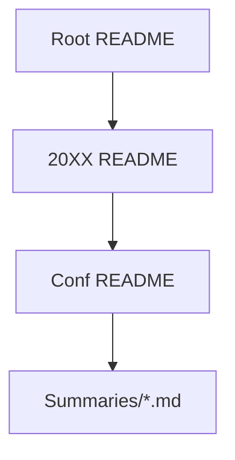

# Conference Summaries 📝

Public Markdown notes from conferences (AI/security/tech). CC BY-NC 4.0 licensed.

## Quick Nav
| Conference | Year | 📍 Location | 📅 Dates | 🔗 Site |
|------------|------|-------------|----------|---------|
| [Unprompted](2026/unprompted/) | 2026 | San Francisco | Mar 3-4 | [Site](https://unpromptedcon.org) |

## Structure

**Pro Tip**: Search "speaker:name" in repo.

## Contributing
PRs for new notes! See AGENTS.md.

*Last Updated: 2026-03-08*
